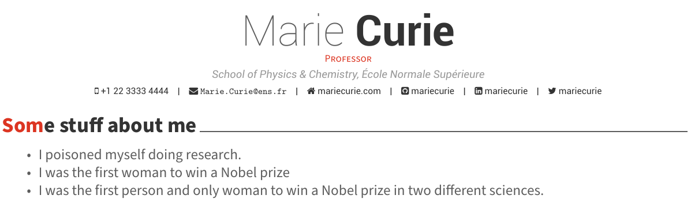

```{r setup, include=FALSE}
knitr::opts_chunk$set(echo = TRUE)
```

I find the process of maintaining my CV and customising its contents to suit each new work opportunity tedious. Since transitioning to write every blog, slide deck, and report with [R Markdown](https://rmarkdown.rstudio.com/), it was especially jarring to go back into my LaTeX editor and update the CV. It soon became abundantly clear to me that writing CVs in R Markdown is a great match, and so at the [2018 rOpenSci OzUnconf](https://ozunconf18.ropensci.org/) [Rob Hyndman](https://robjhyndman.com/) and I set to work on creating the [vitae package](https://pkg.mitchelloharawild.com/vitae/) and automating our CVs.

<div class="l-gutter">
[](https://pkg.mitchelloharawild.com/vitae/)
</div>

The vitae package provides a growing collection of popular LaTeX and HTML CV templates adapted for use with R Markdown. The CV template can be swapped out by simply changing the document's output format, and it is also possible to generate your CV in multiple styles (HTML for your website, and PDF for print/email/forms).

The defining feature of the package is how functions are used in listing your education, experiences, accolades and publications. There are two functions for listing items in vitae: `brief_entries()` and `detailed_entries()`. Both functions accept external data sources that you would typically maintain independently of your CV. For instance, you may actively update your [ORCID](https://orcid.org) with education history. Using the [rorcid](https://docs.ropensci.org/rorcid/) package it is possible to automatically obtain your ORCID records as data and include them in your CV. You may also like to list the R packages you've developed using the [pkgsearch](https://r-hub.github.io/pkgsearch/) package. Any source of data that can be read into a rectangular data format can be used with these functions. This includes local datasets that you directly created - maintaining a record of your professional experiences in a data format is not just useful for a CV, but can be used in generating your website too!

Publications can be entered using the `bibliography_entries()` function, which reads in any bibliography format understood by pandoc (including BibTeX, YAML, and CSL-JSON). The entries are temporarily stored in a tibble, allowing you to filter and modify the entries as needed before including them in your CV.

Lastly, as vitae builds upon R Markdown you can additionally include any figures, tables, or other output you like. Some creative users have used leaflet to map their workplaces around the world, and others have visualised their abilities in programming languages with ggplot2.

## Creating a CV with vitae

### Creating the R Markdown document

The first step in creating your CV with R Markdown using vitae is to choose a template. A summary of available templates can be found here: https://pkg.mitchelloharawild.com/vitae/#templates. This choice can easily be changed later, by simply changing the output format of the R Markdown document. A boilerplate CV document using your chosen template can be created with:

```{r, eval = FALSE}
# Create a starter document for the awesomecv template
rmarkdown::draft(
  "cv.Rmd",                 # The name of the file to create
  template = "awesomecv",   # The selected template
  package = "vitae"         # The package, always "vitae"
)
```

Alternatively, if you use the RStudio IDE you can create the starter document by navigating to "File > New File > R Markdown...". Then on the left panel select 'From Template', and on the right select your chosen vitae template.

This should give you a file that containing the appropriate YAML front matter and a body containing a brief demo of using the three `*_entries()` functions. A shortened preview of this file is given below.

````
---
name: Marie
surname: Curie
position: Professor
address: "School of Physics & Chemistry, École Normale Supérieure"
twitter: mariecurie
date: "`r format(Sys.time(), '%B %Y')`"
output: vitae::awesomecv
---

`r ''````{r setup, include=FALSE}
knitr::opts_chunk$set(echo = FALSE, warning = FALSE, message = FALSE)
library(vitae)
```

# Education

`r ''````{r}
library(tibble)
tribble(
  ~ Degree, ~ Year, ~ Institution, ~ Where,
  "Informal studies", "1889-91", "Flying University", "Warsaw, Poland",
  "Master of Physics", "1893", "Sorbonne Université", "Paris, France",
  "Master of Mathematics", "1894", "Sorbonne Université", "Paris, France"
) %>% 
  detailed_entries(Degree, Year, Institution, Where)
```

````


You can try the template out by knitting this document (<span></img></span> Knit) or running:

```{r, eval = FALSE}
rmarkdown::render(
  "cv.Rmd" # The path to your CV R Markdown document
)
```



### Making the CV your own

From here it's time to modify the template to start creating your own CV. A good place to start is with the YAML front matter, where you can set your name, position and contact information.

Being an R Markdown document, you can then start writing Markdown for the body of your CV. Perhaps start with a brief overview summary, or (as others have done) create a map that displays your relevant experiences. 

The most prominent element of a CV is the listed entries that describe your past employment, education, and other evidence of your expertise. These types of entries can be created with one of three `*_entries()` functions which style the list to suit the selected template. `data %>% brief_entries(what, when, with)` creates a compact list, while `data %>% detailed_entries(what, when, with, where, why)` creates a larger more detailed list. 

The `data` that is used to populate CV entries can come from any data source. It should be structured in a way where each row describes an entry, and the columns are passed into the appropriate field. Using data with this structure makes it easy to `filter()` for experiences relevant to your application. Many users (myself included) maintain a dataset for each type of entry that they like to include in the CV. While these datasets can grow over time as you add more experiences, your CV can be contain a reduced selection of this data to keep it concise and relevant.

If you have published academic work, you might also like to use the `bibliography_entries()` to create a list of your publications. This function accepts common bibliography file formats including BibTeX and CSL-JSON, and then creates a dataset from it. This dataset can then be filtered and modified as needed, and these changes will be reflected in the resulting bibliography list.

Finally, render your document and admire your newly created CV made with R Markdown! Looking for inspiration? Check out what others have done with their vitae CV: https://pkg.mitchelloharawild.com/vitae/#examples-of-using-vitae
